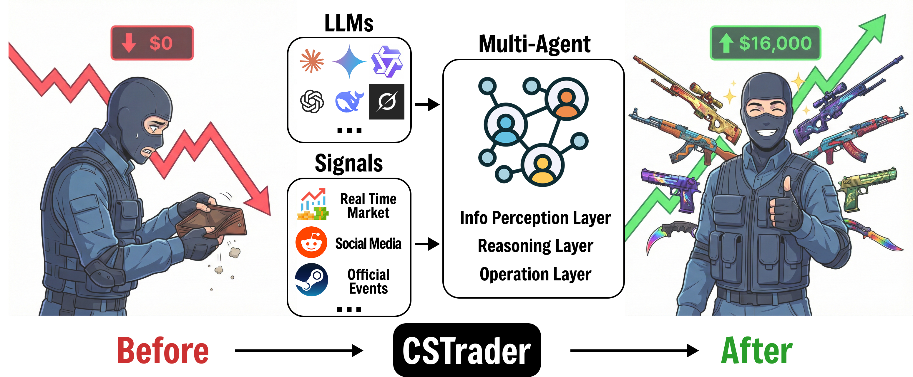
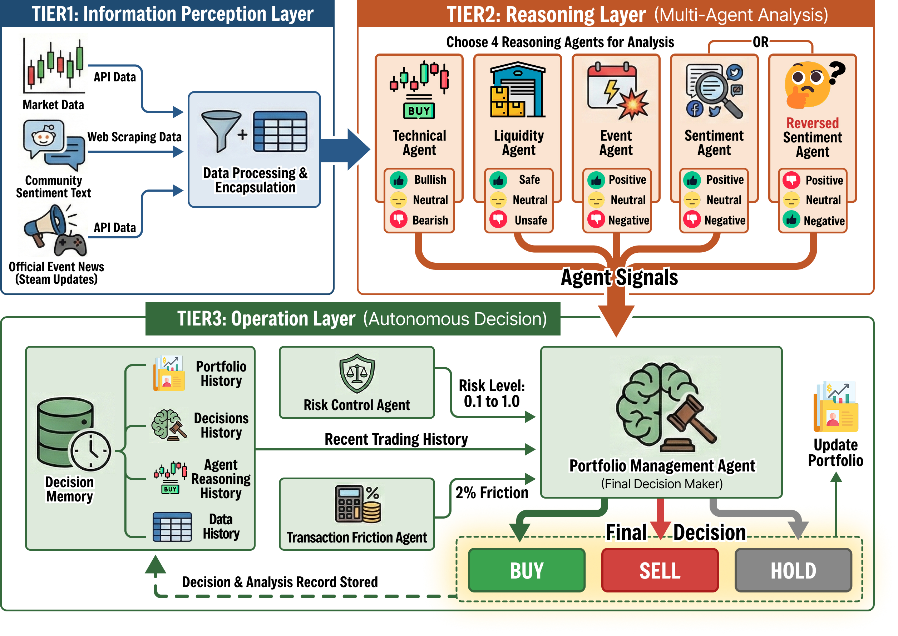

# CSGOTrading: Multi-Agent LLM Framework for CS2 Market Trading

<div align="center">

[](https://opensource.org/licenses/MIT)
[](https://www.python.org/downloads/)
[](https://github.com/langchain-ai/langgraph)
<!-- [](https://arxiv.org/) -->

*An intelligent multi-agent system leveraging Large Language Models for automated Counter-Strike 2 market analysis and trading decisions*

<!-- [Paper](#citation) | [Documentation](#documentation) | [Installation](#installation) | [Quick Start](#quick-start) -->

</div>

---

## 📋 Abstract

**CSGOTrading** presents a novel multi-agent framework that applies Large Language Models (LLMs) to the domain of virtual item trading in Counter-Strike 2 (CS2) markets. Our system employs a hierarchical agent architecture built on LangGraph, incorporating specialized analyst agents (technical, sentiment, liquidity, and event-driven) coordinated by a meta-planner agent. The portfolio manager agent synthesizes multi-modal market signals to generate optimal trading decisions while accounting for transaction costs and risk constraints.

Key contributions:
- **Multi-Agent Architecture**: Modular design with specialized analyst agents for different market aspects
- **Dynamic Agent Selection**: Meta-planner agent adaptively selects relevant analysts based on market conditions
- **Multi-Source Data Integration**: Seamless aggregation of CS2 market data, Steam news, and Reddit sentiment
- **Configurable Workflow**: Support for both agentic workflows and direct LLM analysis modes
- **Risk-Aware Portfolio Management**: Sophisticated position sizing with transaction cost modeling

---

## 🎯 System Concept

<div align="center">

</div>

---

## 🏗️ System Architecture

<div align="center">

</div>


### Agent Specifications

| Agent | Function | Input | Output |
|-------|----------|-------|--------|
| **Planner** | Selects relevant analysts based on market context | Ticker, available analysts | List of selected analysts |
| **Technical Analyst** | Analyzes price patterns and trends | Historical price data | Technical signals (BUY/SELL/HOLD) |
| **Sentiment Analyst** | Processes community sentiment | Reddit posts, Steam news | Sentiment score and direction |
| **Liquidity Analyst** | Evaluates market depth and volume | Order book, trading volume | Liquidity assessment |
| **Event Analyst** | Identifies market-moving events | News, updates | Event impact analysis |
| **Portfolio Manager** | Executes risk-aware trading decisions | Analyst signals, portfolio state | Trading actions with position sizes |

---

## ✨ Key Features

### 🤖 Multi-Modal Analysis
- **Technical Analysis**: Price action, trend detection, support/resistance levels
- **Sentiment Analysis**: NLP-based sentiment extraction from Reddit and Steam communities
- **Liquidity Analysis**: Market depth and volume-based assessments
- **Event-Driven Analysis**: Impact evaluation of game updates and news

### 🧠 Intelligent Agent Coordination
- **Meta-Planner**: Dynamically selects optimal analyst combination for each ticker
- **Modular Design**: Easily extensible agent registry system
- **Flexible Workflows**: Support for both agentic and direct LLM modes

### 💼 Advanced Portfolio Management
- **Risk Control**: Maximum position ratio constraints and drawdown protection
- **Transaction Costs**: Realistic modeling of 2% trading fees
- **Position Sizing**: Intelligent allocation across multiple assets
- **State Persistence**: Complete portfolio history tracking in database

### 🔧 Production-Ready Infrastructure
- **Database Support**: SQLite for local development
- **Multi-Provider LLM**: OpenAI, Anthropic, DeepSeek, Ollama, etc.
- **Extensive Configuration**: 50+ pre-configured experiment setups
- **Comprehensive Logging**: Detailed agent execution and decision tracking

---

## 📦 Installation

### Prerequisites
- Python 3.8 or higher
- pip package manager
- (Optional) SQLite for local database

### Setup

1. **Clone the repository**
```bash
git clone https://github.com/IatomicreactorI/CSGOTrading.git
cd CSGOTrading
```

2. **Create virtual environment**
```bash
python -m venv venv
source venv/bin/activate  # On Windows: venv\Scripts\activate
```

3. **Install dependencies**
```bash
pip install -r requirements.txt
```

4. **Configure environment variables**
```bash
cp .env.example .env
# Edit .env and add your API keys:
# - OPENAI_API_KEY (for OpenAI models)
# - ANTHROPIC_API_KEY (for Claude models)
# - DEEPSEEK_API_KEY (for DeepSeek models)
```

5. **Initialize database**
```bash
python database/cs2_sqlite_setup.py
```

6. **Fetch historical data** 

Before running experiments, you can pre-fetch historical data to avoid API rate limits during backtesting:

**Fetch Reddit data** (past 1 year):
```bash
# From project root directory
python -m apis.reddit.fetch_reddit_data

```
This script fetches Reddit posts from the past year and saves them to `apis/reddit/reddit_data.csv`. No parameters required.

**Fetch Steam news data**:
```bash
# From project root directory
python -m apis.steam.fetch_steam_data \
  --config config/Direct-cd.yaml \
  --start-date 2025-09-25 \
  --end-date 2025-11-15 \
  --limit 15

```

Parameters:
- `--config`: Path to config YAML file (must contain `exp_name` and `tickers`)
- `--start-date`: Start date in YYYY-MM-DD format (required)
- `--end-date`: End date in YYYY-MM-DD format, inclusive (required)
- `--limit`: Maximum news items per ticker per day (default: 15, optional)
- `--output`: Output CSV file path (default: `<script_dir>/steam_data.csv`, optional)

**Fetch CS2 market data**:
```bash
# From project root directory
python -m apis.cs2market.fetch_cs2_data

```
This script fetches current price data for candidate items from Steam Community Market and saves to `apis/cs2market/cs2_data.csv`. No parameters required. The script will automatically retry failed items up to 3 times.

**Note**: These fetch scripts can be run anytime to update the historical data. The main experiment workflow will use these CSV files to avoid making API calls during backtesting.

---

## 🚀 Quick Start

### Basic Usage

Run a single-day experiment with default configuration:

```bash
python run.py --config TS-ds.yaml --start-date 2025-09-25 --end-date 2025-09-25
```

### Batch Experiments

Run multi-day backtesting:

```bash
python run.py \
  --config TS-ds.yaml \
  --start-date 2025-09-25 \
  --end-date 2025-10-27
```

### Configuration Options

The system supports multiple workflow configurations:

- **Direct**: Direct LLM analysis without analyst agents
- **T**: Technical analyst only
- **TS**: Technical + Sentiment analysts
- **TSL**: Technical + Sentiment + Liquidity
- **TSLE**: All analysts (Technical + Sentiment + Liquidity + Event)
- **TSrL**: Technical + Reverse Sentiment + Liquidity

Each configuration can be combined with different LLM providers:
- `-ds`: DeepSeek
- `-gm`: Gemini
- `-gt`: GPT
- `-cd`: Claude
- `-km`: Kimi
- `-qw`: Qwen

Example: `TSLE-cd.yaml` uses all analysts with Claude 3.5 Sonnet.

### View Results

```bash
# View all information of specified experiment
python view.py TS-ds

# View portfolios
python view.py TS-ds portfolios

# View latest positions
python view.py TS-ds positions

# View daily portfolios and export CSV
python view.py TS-ds daily

# View portfolios of specified date
python view.py TS-ds daily 2025-09-26

# Export thinking process JSON file
python view.py TS-ds thinking

# View data summary
python view.py TS-ds summary

# List all experiments
python view.py list
```


### Clear Results
```bash
# Clear experiment data
python clear.py --config-name TS-ds
```

---

## 📊 Configuration

### Workflow Configuration (`config/`)

```yaml
exp_name: "TS-ds"  # Experiment name
cashflow: 10000    # Initial capital
tickers:           # Assets to trade
  - "AK-47 | Redline (Field-Tested)"
  - "AWP | Asiimov (Field-Tested)"

llm:               # LLM configuration
  provider: "deepseek"
  model: "deepseek-chat"

planner_mode: true        # Enable meta-planner
workflow_analysts:        # Available analysts
  - technical
  - sentiment

enable_transaction_fee: true  # Include trading costs
```

### Database Configuration

**Local SQLite** (default):
```bash
python run.py --config TS-ds.yaml
```

---


## 🗂️ Project Structure

```
CSGOTrading/
├── agents/                  # Agent implementations
│   ├── planner.py          # Meta-planner agent
│   ├── portfolio_manager.py # Portfolio management
│   ├── registry.py         # Agent registry
│   └── analysts/           # Specialized analysts
│       ├── technical.py
│       ├── sentiment.py
│       ├── sentiment_reverse.py
│       ├── liquidity.py
│       └── event.py
├── apis/                   # Data source integrations
│   ├── cs2market/          # CS2 market data
│   ├── steam/              # Steam news API
│   ├── reddit/             # Reddit sentiment API
│   ├── router.py           # API router
│   └── common_model.py     # Common data models
├── database/               # Database layer
│   ├── interface.py        # Abstract interface
│   ├── cs2_sqlite_helper.py
│   └── cs2_sqlite_setup.py
├── graph/                  # LangGraph workflow
│   ├── workflow.py         # Main workflow
│   ├── schema.py           # State definitions
│   └── constants.py
├── llm/                    # LLM integration
│   ├── inference.py        # LLM calls
│   ├── provider.py         # Provider configs
│   └── prompt.py           # Prompt templates
├── config/                 # Experiment configurations
├── util/                   # Utilities
│   ├── config.py
│   ├── cs2_db_helper.py
│   └── logger.py
├── figs/                   # Figures and images
├── run.py                  # Main execution script
├── view.py                 # Results visualization
├── clear.py                # Data cleanup
├── requirements.txt
├── .env.example            # Environment variables template
├── LICENSE
└── README.md
```

---

## 🔬 Advanced Usage

### Adding Custom Analysts

1. Create analyst implementation in `agents/analysts/`:

```python
from graph.constants import AgentKey
from llm.inference import agent_call

def custom_analyst(ticker: str, llm_config, analyst_signal):
    # Your analysis logic here
    return {
        "action": "BUY",
        "confidence": 0.8,
        "justification": "Analysis reasoning"
    }
```

2. Register in `agents/registry.py`:

```python
AgentRegistry.register(
    AgentKey.CUSTOM,
    custom_analyst,
    "Custom analyst description"
)
```

3. Add to workflow configuration:

```yaml
workflow_analysts:
  - technical
  - sentiment
  - custom  # Your new analyst
```

### Custom LLM Providers

Add provider configuration in `llm/provider.py`:

```python
@dataclass
class ProviderConfig:
    name: str
    model_class: Any
    requires_api_key: bool = True
    env_key: str = "CUSTOM_API_KEY"
    base_url: str = None

# Register provider
Provider.add_provider("custom", ProviderConfig(...))
```

---

<!-- ## 📚 Documentation

### API Reference

Detailed API documentation is available in the `docs/` directory:
- [Agent Development Guide](docs/agents.md)
- [Database Schema](docs/database.md)
- [Configuration Reference](docs/config.md)
- [LLM Integration](docs/llm.md)

### Workflow Explanation

For a comprehensive understanding of the system workflow, see [WORKFLOW_EXPLANATION.md](WORKFLOW_EXPLANATION.md).

--- -->

## 🤝 Contributing

We welcome contributions from the community! Please follow these guidelines:

1. **Fork the repository** and create a feature branch
2. **Follow PEP 8** coding standards
3. **Add tests** for new functionality
4. **Update documentation** for API changes
5. **Submit a pull request** with a clear description

### Development Setup

```bash
# Install development dependencies
pip install -r requirements-dev.txt

# Run tests
pytest tests/

# Run linting
flake8 .
black .
```

---

## 📄 License

This project is licensed under the MIT License - see the [LICENSE](LICENSE) file for details.

---

## 🙏 Acknowledgments

- **LangChain & LangGraph**: Foundation for agent orchestration
- **OpenAI, Anthropic, DeepSeek**: LLM providers
- **CS2 Community**: Market data and insights
- **Contributors**: All community contributors

---

## 🗺️ Roadmap

### Upcoming Features

- [ ] **Reinforcement Learning Integration**: Train agents with RL for adaptive strategies
- [ ] **Real-time Trading**: Live market integration and execution
- [ ] **Advanced Risk Models**: VaR, CVaR, and Kelly criterion
- [ ] **Multi-Asset Correlation**: Cross-asset analysis and hedging
- [ ] **Web Dashboard**: Interactive visualization and monitoring
- [ ] **Distributed Execution**: Multi-process and cloud deployment
- [ ] **More Data Sources**: Integration with additional market APIs

### Version History

- **v0.1.0** (2026-01-05): Initial release with core multi-agent framework
- **v0.0.1** (2025-12): Private beta testing

---

<div align="center">

**⭐ Star this repository if you find it useful! ⭐**

Made with ❤️ by the CSGOTrading Team

</div>

